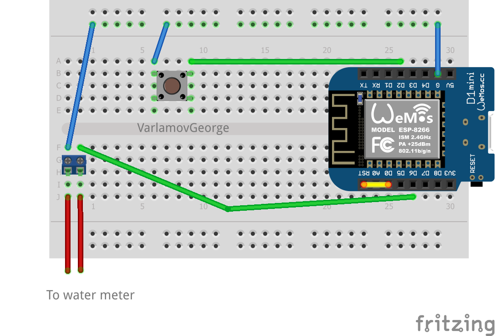

# Water meters IoT project
Проект представляет собой решение для сбора и хранения статистики потребления воды в квартире.

## Возможности:
Проект позволяет реализовать следующие возможности для взаимодействия со счетчиками потребления воды:
- сохранение текущих показаний счетчиков в локальную SQLite базу;
- отображение дашбордов со статистикой потребления;
- взаимодействие с системой через Telegram-бота (просмотр текущих (абсолютных) значений потребления и дельты за месяц/неделю, напоминание об отправке данных на mos.ru).

## Требуемое оборудование
1. Raspberry Pi или любой другой сервер, поддерживающий Python 3, установку Grafana, Mosquitto, Node-RED и SQLite;
1. Wemos D1 mini (или любой другой аналог на основе ESP8266) - по числу счетчиков в квартире (на данный момент поддерживается только 2 шт. максимум);
1. Breadboard для размещения компонент;
1. Тактовая кнопка - по числу Wemos D1 mini;
1. Коннекторы для присоединения к проводам водяных счетчиков - по числу Wemos D1 mini;
1. Сами водяные счетчики (с проводом для подключения к считывающим устройствам).

## Архитектура решения
Рядом с каждым счетчиком воды устанавливается IoT-устройство с WiFi (например - Wemos), которое подключается к счетчику и каждые N минут рассылает данные о текущих значениях потребления с помощью MQTT.

В периметре квартиры (дома) поднимается сервер, с установленной БД и MQTT-брокером сообщений. Сервер подписывается на MQTT-сообщения в топиках для соответствующих счетчиков (для удобства настройки используется Node-RED) и складывает получаемые показания в локальную БД. На том же сервере развернута Grafana для визуализации статистики, а также работает Python-скрипт, отвечающий за Telegram-бота.

### Схема подключения Wemos D1 mini:

  

