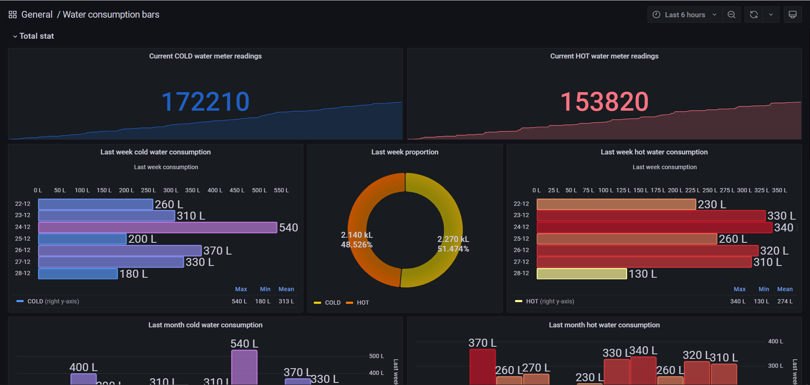

# Water meters IoT project
Проект представляет собой решение для сбора и хранения статистики потребления воды в квартире.

  

## Возможности:
Проект позволяет реализовать следующие возможности для взаимодействия со счетчиками потребления воды:
- сохранение текущих показаний счетчиков в локальную базу данных;
- отображение дашбордов со статистикой потребления;
- взаимодействие с системой через Telegram-бота (просмотр текущих (абсолютных) значений потребления и дельты за месяц/неделю, напоминание об отправке данных на mos.ru и т.д.).

## Требуемое оборудование
1. Raspberry Pi или любой другой сервер, поддерживающий Python 3, установку Grafana, Mosquitto, Node-RED и SQLite;
1. Wemos D1 mini (или любой аналогичный микроконтроллер на основе ESP8266) - по числу счетчиков в квартире (на данный момент поддерживается только 2 шт. максимум);
1. Тактовая кнопка - по числу микроконтроллеров из предыдущего пункта;
1. Breadboard для размещения компонент;
1. Коннекторы для присоединения к проводам водяных счетчиков - по числу микрокроконтроллеров;
1. Водяные счетчики с проводом для подключения к считывающим устройствам. Допускается использование счетчиков с количеством разрядов не более 8 (обычно самый младший разряд отвечает за единицы литров, но это не является обязательным условием). Подключать счетчики к системе необходимо проводами, которые замыкаются каждые N литров (например для VLF-R счетчиков такими проводами являются красный и белый, замыкание происходит каждые 10 литров. Для прочих счетчиков - см. инструкцию производителя).

## Архитектура решения
Рядом с каждым счетчиком воды устанавливается IoT-микроконтроллер с WiFi (например - Wemos D1 mini), который подключается к счетчику его родными проводами, после чего с заданной периодичностью рассылает данные о текущих значениях потребления по протоколу MQTT.

Программа микроконтроллера позволяет работать в двух режимах:
1. Основной режим. Устройство переходит в режим глубокого сна, и просыпается только для:
- опроса счетчика (по умолчанию - раз в 4-5 секунд). При каждом замыкании контактов счетчика текущее показание инкрементируется на 10 литров;
- отправки данных на сервер (по умолчанию - раз в 30 минут). Для этого микроконтроллер стартует в качестве клиента, подключающегося к домашней точке доступа Wi-Fi (2,4 ГГц) и рассылающего сообщения в соответствующий MQTT-топик.

2. Настроечный режим. Микроконтроллер функционирует в качестве точки доступа Wi-Fi (2,4 ГГц), после подключения к которой пользователю становится доступна web-страница настроек.

В периметре квартиры (дома) поднимается Linux-сервер, с установленной БД и MQTT-брокером сообщений. Сервер подписывается на MQTT-сообщения в топиках для соответствующих счетчиков (для удобства настройки используется Node-RED) и складывает получаемые показания в локальную БД. На том же сервере развернута Grafana для визуализации статистики, а также работает Python-скрипт, отвечающий за Telegram-бота.

### Схема подключения Wemos D1 mini:

  

### Прошивка микроконтроллера
Перед заливкой скетча в микроконтроллер в параметре WATER_CODE необходимо указать корректное значение типа воды (1 - холодная, 2 - горячая). А также, при желании, указать свои имена MQTT-топиков. По умолчанию используются:
- WATER_COLD и WATER_HOT - для передачи показаний;
- WATER_COLD/CMD и WATER_HOT/CMD - для удаленной корректировки текущего показания, хранящегося в микроконтроллере;
- WATER_COLD/FEEDBACK и WATER_HOT/FEEDBACK - для получения подтверждений о приеме микроконтроллером скорректированного показания.

В случае использования Wemos D1 mini перемычка, соединяющую контакты D0 и RST, требуется для пробуждения микроконтроллера для выхода из глубокого сна. При прошивке микроконтроллера данную перемычку необходимо извлечь.

### Добавление текущих показаний и ввод SSID домашней Wi-Fi сети
Перед началом эксплуатации после заливки скетча в микроконтроллер необходимо выполнить следующие шаги для первоначальной настройки:
1. Перевести микроконтроллер в настроченый режим работы. Для этого необходимо подать питание, одновременно удерживая кнопку.
Если устройство уже подключено к питанию, то для перехода в режим настройки необходимо удерживать кнопку в течение 5-10 секунд. Если все сделано правильно, то в списке доступных точек доступа появится сеть с SSID="WaterCounter".
1. С любого устройства подключиться к созданной на предыдущем шаге точке доступа (по умолчанию пароль точки доступа отсутствует).
1. Перейти на страницу 192.168.4.1. Отобразиться страница с настройками IoT-устройства, а также список SSID видимых точек доступа 2,4 ГГц, доступных микроконтроллеру.
1. Ввести SSID и пароль домашней точки доступа Wi-Fi (если сеть видима - сначала следует убедиться, что SSID отображается в списке сетей из предыдущео шага инструкции). Именно к этой сети микроконтроллер будет подключаться в основном режиме работы.
1. Указать текущее значение счетчика (в литрах), к которому будет подключен данный микроконтроллер.
1. Нажать кнопку "Submit", после чего отключить микроконтроллер от питания и снова включить. Устройство перейдет в основной режим работы.

### Отправка корректирующих значений в микроконтроллер
Если необходимо скорректировать показания счетчика без подключения микроконтроллера к ПК или перехода в настроечный режим, необходимо отправить команду вида "\<type\>|set|\<value\>" в соответствующий MQTT-топик (см. раздел "Прошивка микроконтроллера").

Где:
- \<type\> - значение типа воды (1 - холодная, 2 - горячая),
- \<value\> - новое показание (в литрах).

Микроконтроллер получит корректировку при следующем подключении к MQTT-брокеру (т.е. в рамках процесса отправки данных на сервер). Результат обработки команды микроконтроллером будет направлен в соответствующий MQTT-топик с суффиксом "/FEEDBACK" ((см. раздел "Прошивка микроконтроллера").
